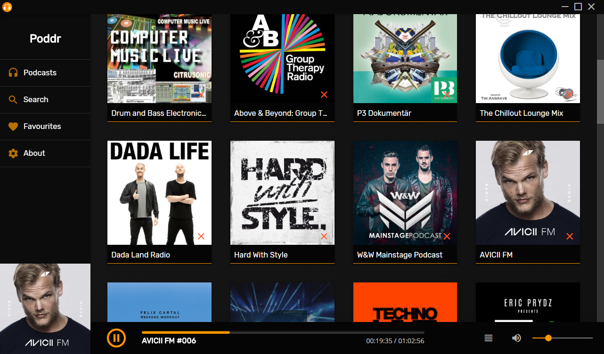
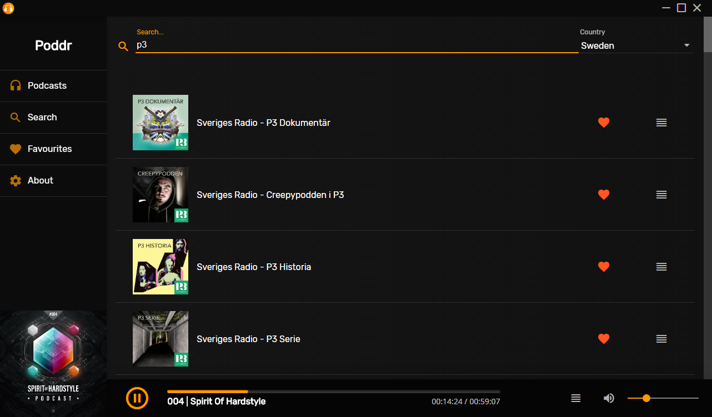
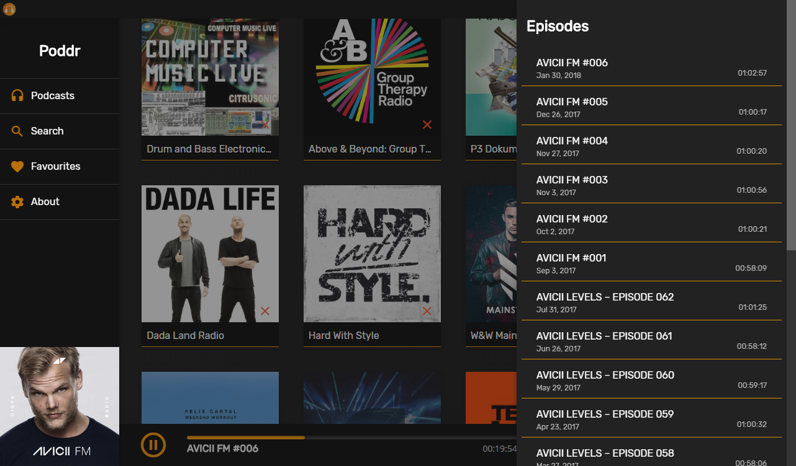

    
    <h1>Poddr</h1>
    

Podcast client built with Electron and Angularjs.

It uses iTunes RSS feeds and search API to gather its information.
### Screenshots

### Download

[GitHub Releases](https://github.com/Sn8z/Poddr/releases)

#### Windows

The downloaded file is a normal .exe file. Just doubleclick it and install as usual.

#### Linux

For Linux we use the format .AppImage!

Quotes from [AppImage projectpage](https://appimage.org)
> AppImages can be downloaded and run without installation or the need for root rights.

> The key idea of the AppImage format is one app = one file. Every AppImage contains an app and all the files the app needs to run. In other words, each AppImage has no dependencies other than what is included in the targeted base operating system(s).

Just download and make the file [executable](https://discourse.appimage.org/t/how-to-make-an-appimage-executable/80)