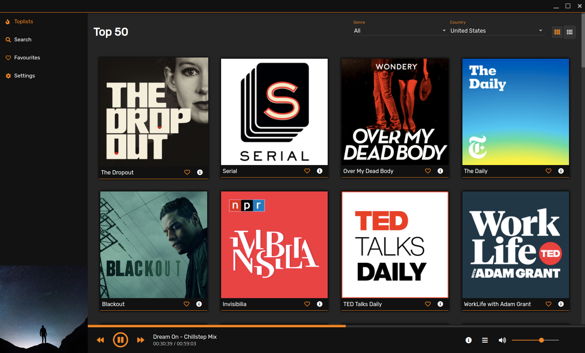
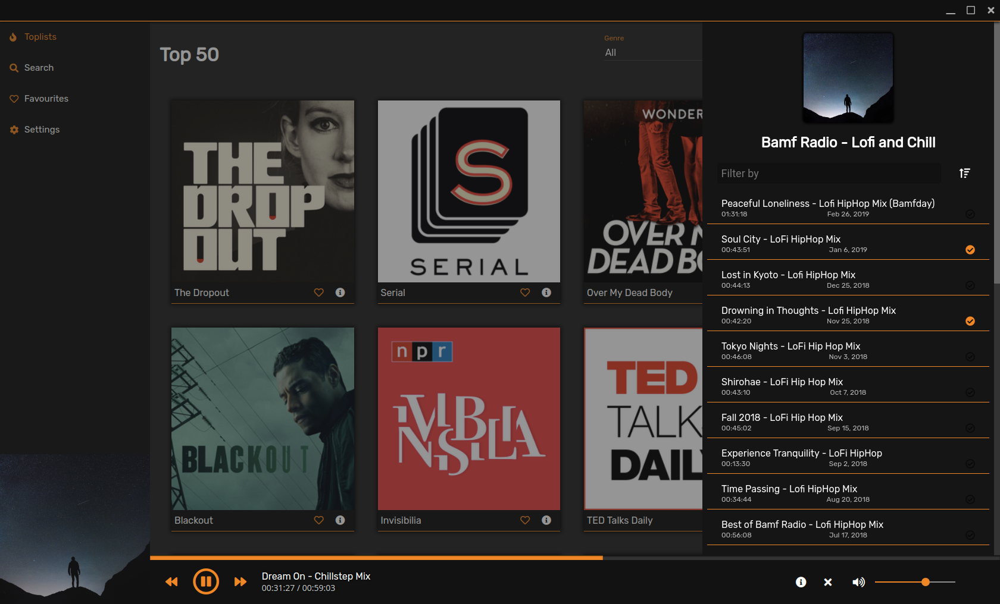
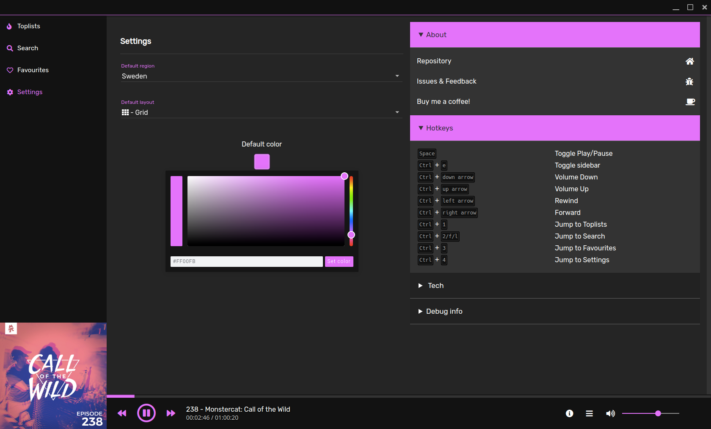

<div align="center">
    
    <h1>Poddr</h1>
    
    
    
    
</div>


[Website](https://sn8z.github.io/Poddr/)
 
Podcast client built with Electron and Angular.
 
Poddr uses iTunes RSS feeds and Search API to gather information.
### Screenshots







### Downloads

[GitHub Releases](https://github.com/Sn8z/Poddr/releases)

### Windows

The downloaded file is a normal .exe file. Just doubleclick it and install as usual.

### Linux

#### Snap

[](https://snapcraft.io/poddr)

or

```snap install poddr```

#### AppImage

Quotes from [AppImage projectpage](https://appimage.org)
> AppImages can be downloaded and run without installation or the need for root rights.

> The key idea of the AppImage format is one app = one file. Every AppImage contains an app and all the files the app needs to run. In other words, each AppImage has no dependencies other than what is included in the targeted base operating system(s).

[Download](https://github.com/Sn8z/Poddr/releases) and make the file [executable](https://discourse.appimage.org/t/how-to-make-an-appimage-executable/80)

#### Mac

A normal .dmg file, install as you would normally do with any Mac software.

<hr>

## Sponsors
Becoming a Main sponsor will grant you a place here. Read more in the section below if you want to learn how you can contribute to Poddr.

<hr>

## Sponsoring Poddr

If you enjoy using Poddr and want to contribute to keeping development alive you can make a monetary donation.

There are a number of different ways you can do this.

* ### [GitHub Sponsor](https://github.com/users/Sn8z/sponsorship)
I've recently been invited to the [GitHub sponsor program](https://help.github.com/en/articles/about-github-sponsors) which means you can sponsor me directly on GitHub and during my first year GitHub will [match any sponsorship](https://help.github.com/en/articles/about-github-sponsors#about-the-github-sponsors-matching-fund).

Sponsor me [here](https://github.com/users/Sn8z/sponsorship).

* ### [Patreon](https://www.patreon.com/join/poddr)
For those of you who wants to make a monthly donation but don't have GitHub there's a [Patreon page](https://www.patreon.com/join/poddr) available aswell.

* ### One-time donations
If you want to make a onetime donation there's two different ways, either [PayPal](https://paypal.me/sn8z) or [Ko-Fi](https://ko-fi.com/O5O2ETUW).

<hr>
<div align="center">


### A big thanks to [Radu Dan](https://www.instagram.com/radudangratian/) for creating the logo for Poddr!
</div>
<hr>