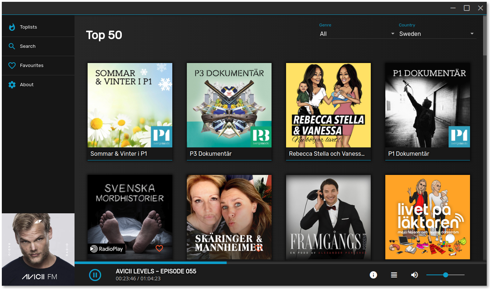
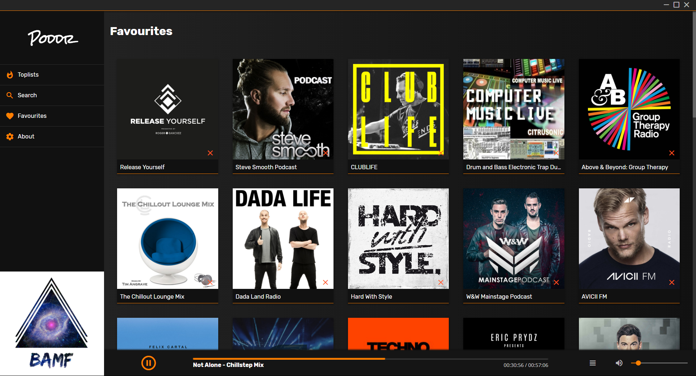

    
    <h1>Poddr</h1>

    
    
    
    

 
Podcast client built with Electron and AngularJS.
 
Poddr uses iTunes RSS feeds and Search API to gather information.
### Screenshots

### Downloads

[GitHub Releases](https://github.com/Sn8z/Poddr/releases)

### Windows

The downloaded file is a normal .exe file. Just doubleclick it and install as usual.

### Linux

#### Snap

Coming soon...

#### AppImage

Quotes from [AppImage projectpage](https://appimage.org)
> AppImages can be downloaded and run without installation or the need for root rights.

> The key idea of the AppImage format is one app = one file. Every AppImage contains an app and all the files the app needs to run. In other words, each AppImage has no dependencies other than what is included in the targeted base operating system(s).

[Download](https://github.com/Sn8z/Poddr/releases) and make the file [executable](https://discourse.appimage.org/t/how-to-make-an-appimage-executable/80)

#### Mac

A normal .dmg file, install as you would normally do with any Mac software.

#### If you enjoy using Poddr and want to contribute feel free to [buy me a coffee!](https://ko-fi.com/sneitz)